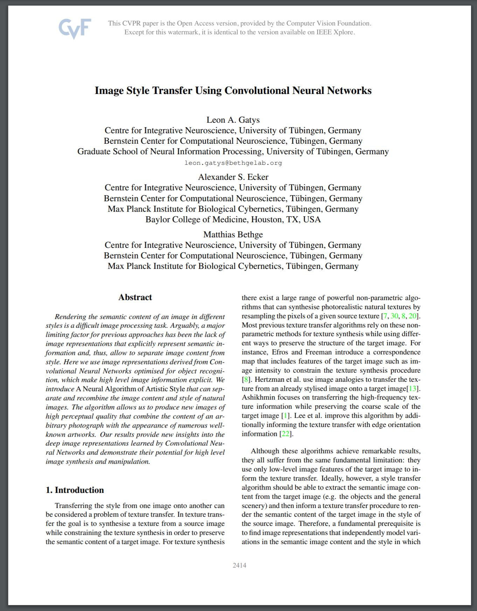

#  Image Style Transfer using Convolutional Neural Networks

This is an unofficial implementation of the paper:

L. A. Gatys, A. S. Ecker and M. Bethge, "Image Style Transfer Using Convolutional Neural Networks," 2016 IEEE Conference on Computer Vision and Pattern Recognition (CVPR), Las Vegas, NV, 2016, pp. 2414-2423, doi: 10.1109/CVPR.2016.265.

<a href=https://www.cv-foundation.org/openaccess/content_cvpr_2016/papers/Gatys_Image_Style_Transfer_CVPR_2016_paper.pdf>
  

    
  

</a>

Effort has been put to provide an implementation as similar as possible to the one described in the paper.
Code is made easy to follow and understand, with variable naming conventions
reflecting the paper. Comments in code reflect citations from the paper. Framework of choice is PyTorch.
