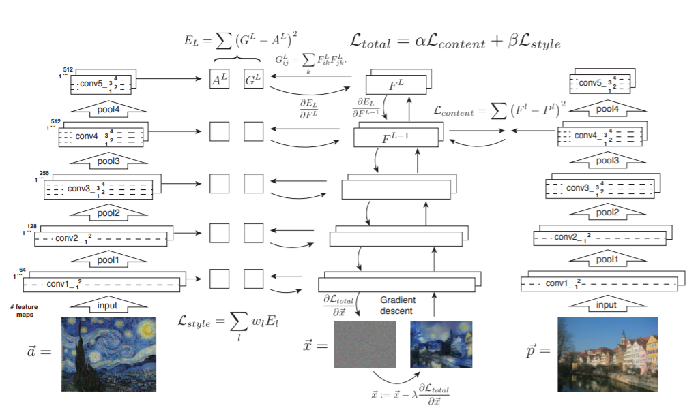
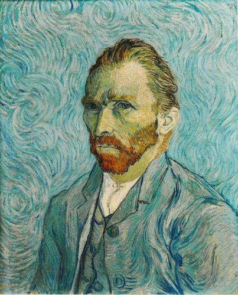

#  Image Style Transfer using Convolutional Neural Networks

This is an unofficial implementation of the paper:

[L. A. Gatys, A. S. Ecker and M. Bethge, "Image Style Transfer Using Convolutional Neural Networks," 2016 IEEE Conference on Computer Vision and Pattern Recognition (CVPR), Las Vegas, NV, 2016, pp. 2414-2423, doi: 10.1109/CVPR.2016.265.](https://www.cv-foundation.org/openaccess/content_cvpr_2016/papers/Gatys_Image_Style_Transfer_CVPR_2016_paper.pdf)

<a href=https://www.cv-foundation.org/openaccess/content_cvpr_2016/papers/Gatys_Image_Style_Transfer_CVPR_2016_paper.pdf>
  <p align="center">
    
  </p>
</a>


Effort has been put to provide an implementation as similar as possible to the one described in the paper.
Code is made easy to follow and understand, with naming conventions
reflecting the paper. Comments in code reflect citations from the paper. Framework of choice is PyTorch.

## Architecture

<p align="center">

</p>

## Usage
Along with style transfer the code is flexible enough to also perform style and content reconstruction
from a white noise image by setting either the content weight or the style weight to zero.


Style Transfer:
```
bash scripts/style_transfer.sh
```
Style Reconstruction:
```
bash scripts/style_reconstruction.sh
```
Content Reconstruction:
```
bash scripts/content_reconstruction.sh
```

## Example

<p align="center">



</p>

For more examples see the images inside the output folder along with their log files for reproducibility.

## Tips
Style transfer is highly sensitive to the chosen content representation and style representation layers
as well as to the style and content weights so be sure to experiment with those in order to get an appealing result. 
Reasonable parameter values are already set as defaults. 

## Citation
Please use this bibtex if you want to cite this repository:
```
@misc{Koch2020nstpaper,
  author = {Koch, Brando},
  title = {neural-style-transfer-paper},
  year = {2021},
  publisher = {GitHub},
  journal = {GitHub repository},
  howpublished = {\url{https://github.com/bkoch4142/neural-style-transfer-paper}},
}
```

## License
This repository is under an MIT License


[](https://github.com/bkoch4142/neural-style-transfer-paper/blob/master/LICENSE)
